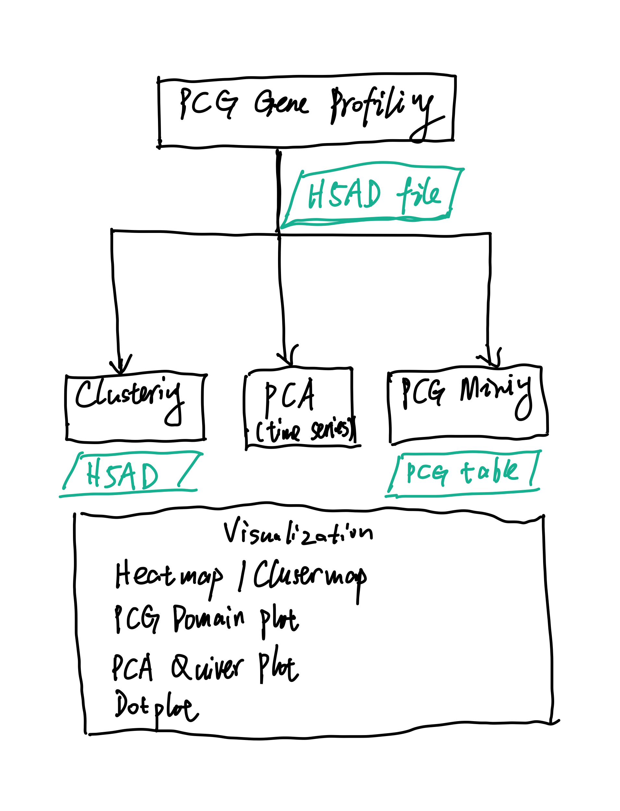

# PCG Analysis
We conducted a qualitative analysis of Positional Control Genes (PCGs) spaning the planarian body axis. Here we offer three major ways to

* [PCG Gene Profiling](#pcg-gene-profiling)
* [Clustering](#clustering)
* [PCA](#pca)
* [PCG Mining](#pcg-mining)
* [Turing System of PCG](#turing-system-of-pcg)

## PCG Gene Profiling
In order to generate xxx data, 

## Clustering
To xxx. 

## PCA
(time series)

## PCG Mining
To detect new potential PCGs in the data, xxx.

## Turing System of PCG
xx
