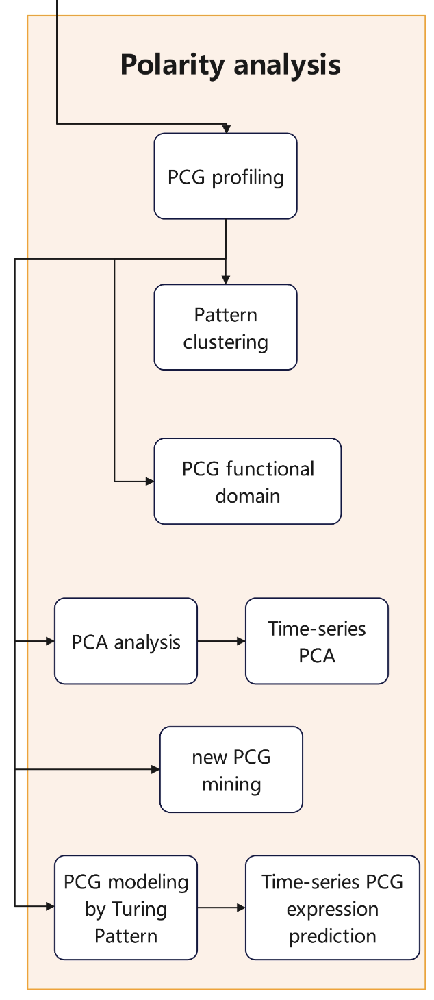

# Polarity Analysis
To investigate spatial patterns of gene expression capture positional gradients, we conducted a qualitative analysis of `positional control genes (PCGs)` spanning the planarian body axis. 

This section mainly contains:

* [PCG Gene Profiling](#pcg-gene-profiling)
* [Clustering](#clustering)
* [PCA](#pca)
* [PCG Mining](#pcg-mining)
<p align="center">
    
</p>


## PCG Gene Profiling
First, 
```
usage: AP_Profiling [-h] -i INPUT -o OUTPUT [-m MIN_BIN] [-n NUM_HVG] [-b BIN_NUM]

Create AP Profiling for genes.

optional arguments:
  -h, --help            show this help message and exit
  -i INPUT, --input INPUT
                the input adata, Notice: we expect raw count matrix!!!
  -o OUTPUT, --output OUTPUT
                the output prefix
  -m MIN_BIN, --min_bin MIN_BIN
                the minimum allowed cell number of a bin, default(50)
  -n NUM_HVG, --num_HVG NUM_HVG
                the number of HVG bin, default(5000)
  -b BIN_NUM, --bin_num BIN_NUM
                the total bin number, default(100)

Best wishes
```

## Clustering
Then, perform clustering via `hdbscan` and `LogicRegression`.
```
from pcg_pattern import *
from sklearn.linear_model import LogisticRegression
import hdbscan

# Load data in anndata format
adata = sc.read_h5ad(file_name)
df = adata.to_df()  # ensure rows are genes/obs and columns are bins/features, if not, transpose matrix first

# First round of clustering using hdbscan
clusterer = hdbscan.HDBSCAN()
clusterer.fit(df.to_numpy())
labels = clusterer.labels_
labels = labels.astype(int)

# Second round of "clustering"
# for those genes that were not assigned into a cluster in the first round (labeled as -1), use LogicRegression to find which cluster's genes it is most similar to
svc = LogisticRegression()
svc.fit(df.to_numpy(),labels[labels!=-1])
recall_non_labels = svc.predict(df[labels==-1].to_numpy())

# save results
```
Visualization: 
```
# heatmap
plot_heatmap(df.to_numpy(), labels)
```

## PCA
PCG data in PCA space
```
python pca.py -h
usage: pca.py [-h] [--name NAME] [--symbol SYMBOL] [--trainingData TRAININGDATA] [--pcg PCG] [--genes GENES]
              [--classes CLASSES] [--data DATA]

PCA

optional arguments:
  -h, --help            show this help message and exit
  --name NAME, -n NAME  sample name
  --symbol SYMBOL, -s SYMBOL
  --trainingData TRAININGDATA, -t TRAININGDATA
                        training dataset, cols are genes, rows are bins
  --pcg PCG, -p PCG     known pcg list file
  --genes GENES, -g GENES
                        target gene list file
  --classes CLASSES, -c CLASSES
                        pcg class file
  --data DATA, -i DATA  data expression file to project in PC space, cols are genes, rows are bins

example:
      python pca.py -i total.csv -t WT.csv -p pcg.txt -c pcg_class.txt -n test_WT
      python pca.py -i total.csv -t WT.csv -g filtered_gene.txt -p pcg.txt -c pcg_class.txt -n test_WT -s symbols.txt
```

## PCG Mining
Find genes that could be PCGs by calculating and evaluating correlation coefficient values between known PCGs (from published studies) and target genes.
```
# A. Use Spearman's rank correlation coefficient
import scipy.stats
import scanpy as sc
import pandas as pd

adata = sc.read_h5ad(file_name)
df = adata.to_df()
target_genes = list(df.columns)  # or assigned by users
with open('known_pcgs.txt', 'r') as f:
    known_pcgs = f.read().splitlines()

# Spearman's rank correlation coefficient
df_data = {'gene':[], 'pcg':[], 'scc':[]}
for gene in target_genes:
    for pcg in known_pcgs:
        if pcg in df.columns and pcg != gene:
            df_data['gene'].append(gene)
            df_data['pcg'].append(pcg)
            scc = scipy.stats.spearmanr(df[gene], df[pcg]).correlation
            df_data['scc'].append(scc)

results = pd.DataFrame(df_data)
results = results.sort_values(by='scc', ascending=False)
results.to_csv('spearman.csv', index=False)
```
