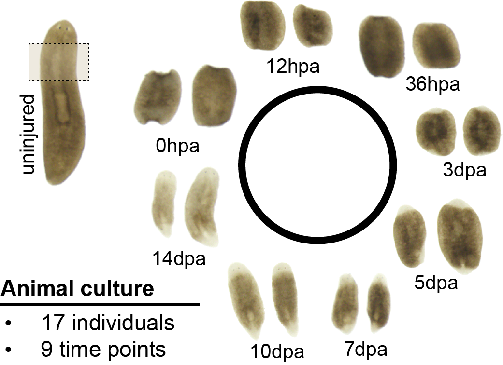
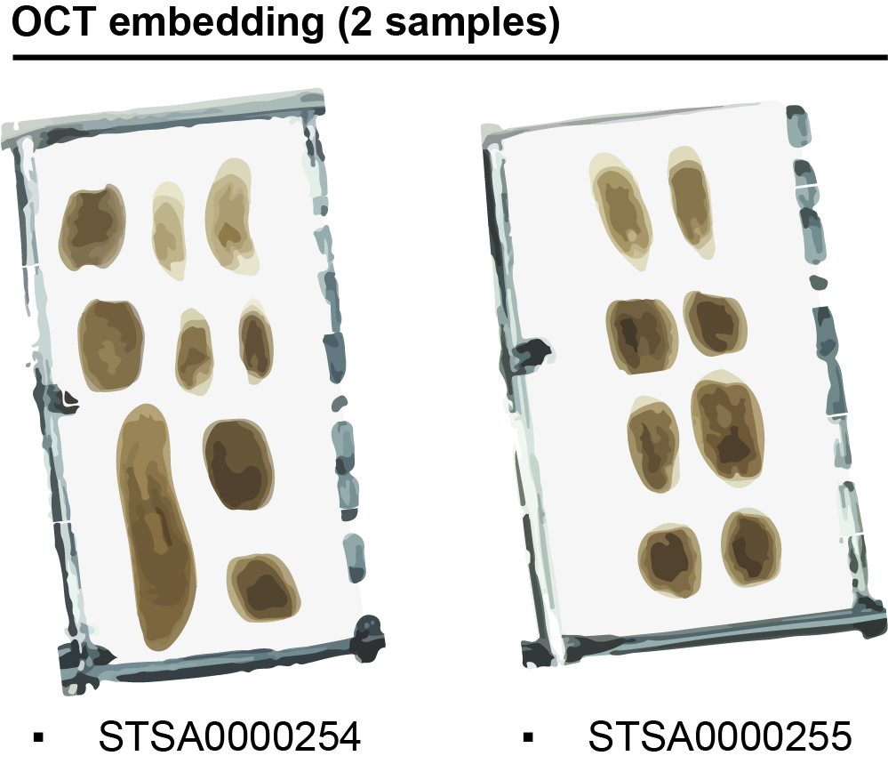
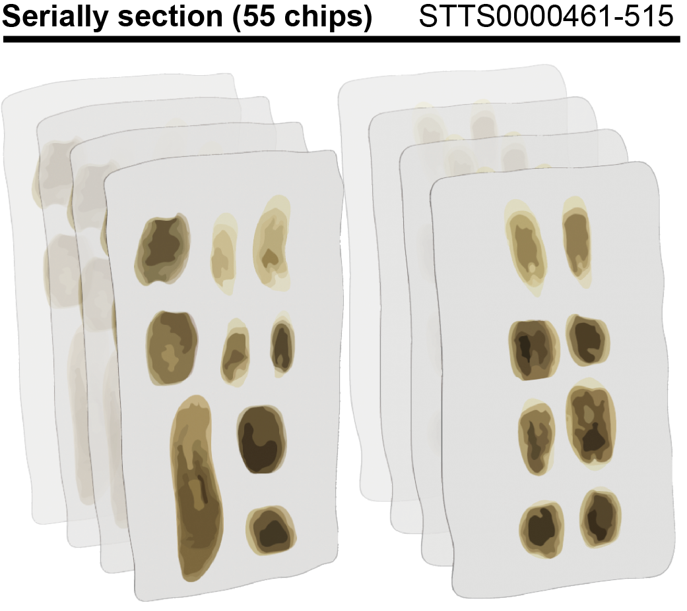

.. _`sampling-design`:
===============
Sampling Design
===============
This section contains description of our sampling design and data organization in STOmicsDB.

Sampling
--------

    Planarian animals of one uninjured individual and 16 regenerative individuals from eight distinct stages were sampled.

Planarian animals of one uninjured individual and 16 regenerative individuals from eight distinct stages were sampled.

Sample fixation
---------------

    Individuals were embedded into two OCT blocks, of which relevant data were organized as two samples in `STOmicsDB <https://db.cngb.org/stomics/>`_ database. 

Individuals were embedded into two OCT blocks, of which relevant data were organized as two samples in `STOmicsDB <https://db.cngb.org/stomics/>`_ database. 
  * `STSA0000254 <https://db.cngb.org/stomics/sample/STSA0000254/>`_
  * `STSA0000255 <https://db.cngb.org/stomics/sample/STSA0000255/>`_

Stereo-seq
----------

    Each sample block was serially sectioned at 10 µm intervals throughtout the entire animal body. Each section was individually mounted onto the Stereo-seq chip. 

    Sections on the chip were stained with nucleic acid dye for single-stranded DNA (ssDNA) visualization and further processed throughout library construction and sequencing. 

Each sample block was serially sectioned at 10 µm intervals throughtout the entire animal body. Each section was individually mounted onto the Stereo-seq chip. 

Sections on the chip were stained with nucleic acid dye for single-stranded DNA (ssDNA) visualization and further processed throughout library construction and sequencing. 

