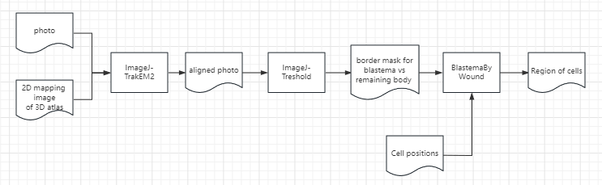
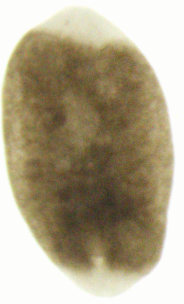
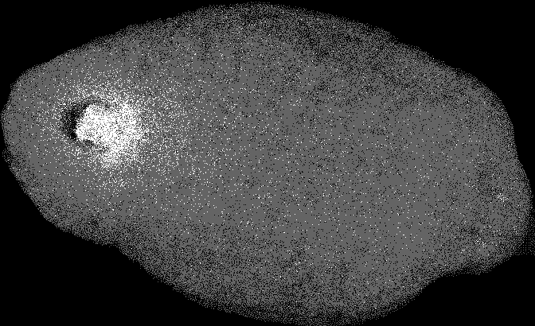
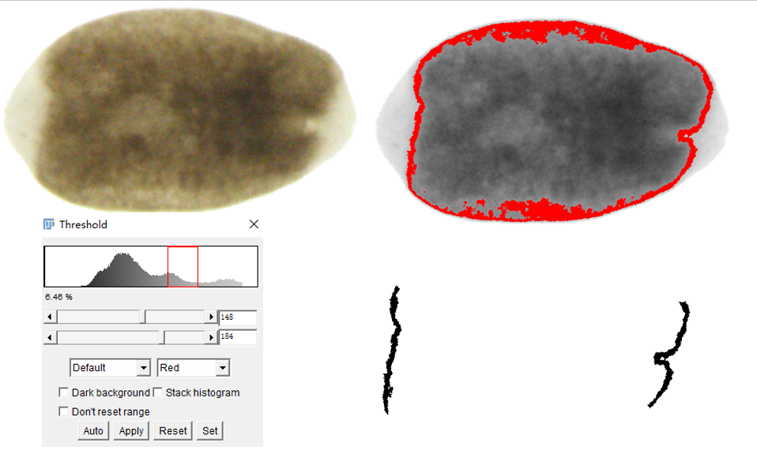
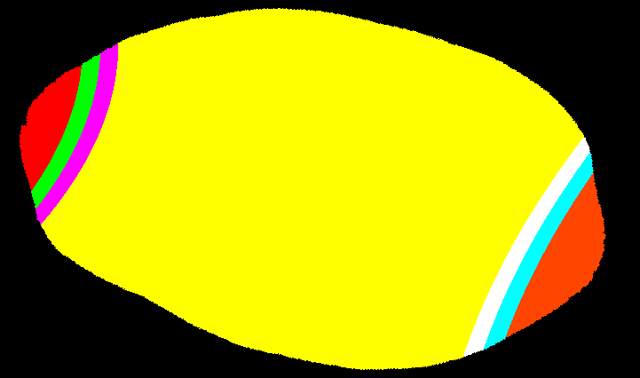

.. _`assign_blastema_region`:
========================================
Detect blastema by pigment difference
========================================

workflow
========================================

example images
========================================

raw photo
************************************

2D mapping photo of 3D atlas
************************************

align photo and detect wound mask
************************************

now assign region to each cell
************************************

.. code-block:: python3
./BlastemaByWound_v2.py

Usage: python3 BlastemaByWound.py < -p prefix>
                                     [ -o output prefix, default output]
                                     [ -e exponential number, default 2]
                                     [--only_wound yes/no, default no]
                                     [--ll left wound left extern distance, default 20]
                                     [--lr left wound right extern distance, default 20]
                                     [--rl right wound left extern distance, default 20]
                                     [--rr right wound right extern distance, default 20]

Note: the unit of distance is 3 micron, so the default 10 refer to 60 microns.

Example :
          example 01: python3 BlastemaByWound.py -p 12hpa1
          example 02: python3 BlastemaByWound.py -p WT -o test_WT
          example 02: python3 BlastemaByWound.py -p 5dpa1 -o test_5dpa1 -e 3
          example 03: python3 BlastemaByWound.py -p 3dpa1 -o test_3dpa1_lr15 --lr 15

Output label :
          1 -- [red]     left blastema
          2 -- [green]   left margin of left wound
          3 -- [magenta] right margin of left wound
          4 -- [yellow]  body
          5 -- [white]   left margin of right wound
          6 -- [cyan]    right margin of right wound
          7 -- [orange]  right blastema

Output label in only_wound mode:
          3 -- [magenta] left wound region, similar to 1+2+3 in blastema mode
          4 -- [yellow]  body
          5 -- [white]   right wound region, similar to 5+6+7 in blastema mode

final region image
========================================

