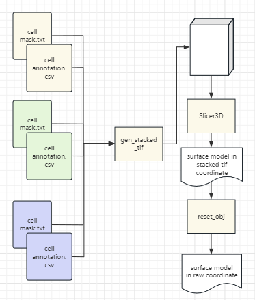

.. _`meshgen`:
========================================
Mesh generation pipeline
========================================

.. note:: 
meshgen pipeline aims to generate 3D mesh models

workflow
---------------------------------

usage
---------------------------------

gen stacked tif
+++++++++++++++++++++

.. code-block:: python3

    python3 gen_stacked_tif.py 
===================== ================================================================================================
argument              description
===================== ================================================================================================  
-i                    mask.lst
-a                    anno.txt
-o                    output prefix
-b                    binsize default 20
===================== ================================================================================================  

mask.lst example
***********************

the first column is the z value ( must start from 0 ), and the second column is cellbin mask file

    0 s0.mask

    1 s1.mask

    ...

    n sn.mask

anno.txt example
***********************

    slice_id,cell_id,anno_id

    1,11,1

    2,12,2

the slice id starts from 1

reset obj
+++++++++++++++++++++

.. code-block:: python3

    python3 reset_obj.py  

===================== ================================================================================================
argument              description
===================== ================================================================================================  
-i                    in.obj
-o                    output prefix
-b                    binsize default 20
===================== ================================================================================================  

