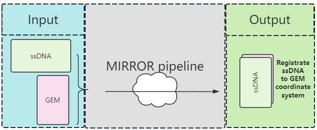
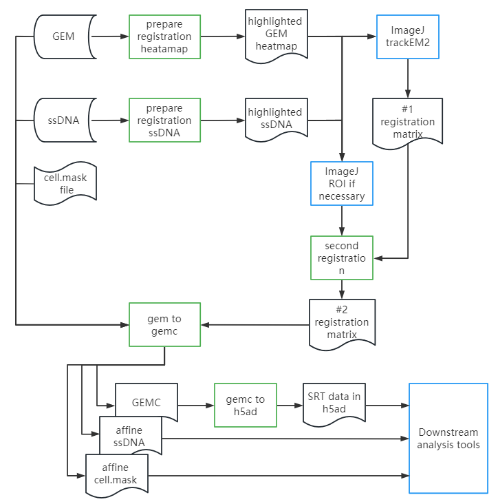

.. _`mirror`:
========================================
MIRROR pipeline
========================================

The mirror pipeline aims to register ssDNA image to GEM coordinate system with minimum registration error.

workflow
---------------------------------

usage
---------------------------------
main usage

.. code-block:: python3

    MIRROR.py -h

Usage:

    MIRROR.py action [options]

Actions:

    prepare_registration_heatmap

    prepare_registration_ssdna

    second_registration

    gem_to_gemc

    gemc_to_h5ad

prepare_registration_heatmap
++++++++++++++++++++++++++++++++++++

Usage : MIRROR.py prepare_registration_heatmap

===================== ================================================================================================
argument              description
===================== ================================================================================================   
-g                    gem file
-o                    output prefix 
-c                    chip715/chip500, default chip715
-e                    enhance by bin5, default not set
-n                    yes/no draw trackline, default yes
-x                    xmin, default None and calculate real xmin
-y                    ymin, default None and calculate real ymin
===================== ================================================================================================   

prepare_registration_ssdna
++++++++++++++++++++++++++++++++++++
Usage : MIRROR.py prepare_registration_ssdna 

===================== ================================================================================================
argument              description
===================== ================================================================================================  
-d                    ssdna tif/png file
-o                    output prefix
-c                    chip500/chip715, default chip715
-w                    um per pixel in width,  default 0.4803250
-h                    um per pixel in height, default 0.4802272
-f                    midfilt or not. default not set
-m                    min_brightness, default 1
-M                    generate mask, default not set 
===================== ================================================================================================

second_registration
++++++++++++++++++++++++
Usage : MIRROR.py second_registration 

===================== ================================================================================================
argument              description
===================== ================================================================================================  
-H                    heatmap.trackline.tif/png
-d                    ssDNA.trackline.tif/png
-o                    output prefix
-f                    Fujiyama output matrix, default None
-t                    TrackEM output matrix, default None
-a                    3*3 backward affine matrix, default none
-c                    chip715/chip500, default chip500
-w                    um per pixel in width,  default 0.5
-h                    um per pixel in height, default 0.5
-l                    S/M/L search area. default S
-s                    thread number, default 8
-r                    roi json file, default none
-F                    yes/no, default no. fake round2
===================== ================================================================================================  

Note:
     please only use one of ( -f , -a , -t ) .

Example of matrix
************************

A 3*3 backward affine matrix
~~~~~~~~~~~~~~~~~~~~~~~~~~~~~~~~~~~~

    -f '[[0.033629421,0.983042659,-133.4590388],[-0.983042659,0.033629421,2262.081494],[0,0,1]]'

A 3*4 Fujiyama output matrix
~~~~~~~~~~~~~~~~~~~~~~~~~~~~~~~~~~~~

    -a '0.9789672225355872 -0.014001262294250694 0 0.014001262294229377 0.9789672225355872 0 0 0 0.9790673409653101 -49.386112981985995 -98.51787299912003 0'

A 2*3 TrackEM output matrix
~~~~~~~~~~~~~~~~~~~~~~~~~~~~~~~~~~~~

    -t '-0.010963829,-0.999939895,0.999939895,-0.010963829,-129.2603788,1664.628308'
