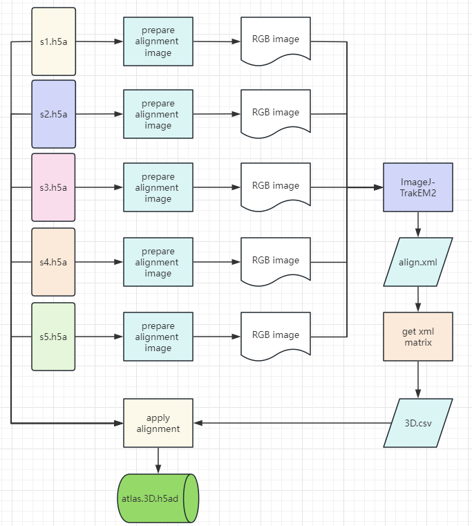

.. _`seam`:
========================================
seam pipeline
========================================

.. note:: 
seam pipeline aims to align and merge serial slices (each slice in an H5AD file) into one 3D atlas ( one H5AD file with aligned 3D coordinates)

Workflow
======================================
seam pipeline contains three main steps:

* prepare alignment images
* align all images
* apply alignment to raw data and merge

Usages
======================================

the main usage

.. code-block:: python3
  SEAM.py -h
  > Usage:
  > SEAM.py action [options]
  >
  > Actions:
  >   prepare_alignment_image
  >   get_xml_matrix
  >   apply_alignment

prepare_alignment_image usage
======================================

.. code-block:: python3
  SEAM.py prepare_alignment_image -h
  > Usage :
  > SEAM.py  prepare_alignment_image   -m <mask.txt>
  >                                    -o <output.png>
  >                                    -t <celltype.csv>

get_xml_matrix usage
======================================

.. code-block:: python3
  SEAM.py get_xml_matrix -h
  >Usage :
  > SEAM.py get_xml_matrix.py -i <file.xml>
  >                           -o  <output>
  
apply_alignment usage
======================================

.. code-block:: python3
  SEAM.py apply_alignment -i <input.json or input.csv>
  >                         -o <output prefix>
  >                         -W [the width of aligned image, default equal to input image]
  >                         -H [the height of aligned image, default equal to input image]
  >                         -m [True/False, merge all h5ad to one if True, default False]
  >                         -S [True/False, add Sn to cell name if -m=True, default False ]

The detail of input csv or json file:
======================================

Example of input.json  :
************************
 [
      ['S1',"gemfile_1","h5adfile_1","ssdnafile_1","maskfile_1","[[1,0,10], [0,1,0],[0.0, 0.0, 1.0]]","z_value","[[1,0,0], [0,1,0],[0.0, 0.0, 1]]","outlinefile_1",10,0],
       
      ['Sn',"gemfile_N","h5adfile_N","ssdnafile_N","maskfile_N","[[1,0,10], [0,1,0],[0.0, 0.0, 1.0]]","z_value","[[1,0,0], [0,1,0],[0.0, 0.0, 1]]","outlinefile_N",0,10]
 ]

Detail of items in data:
************************
     1. Sn: name of this data.
     2. gemfile_N: the GEM/GEMC file of this data, use "" if unavailable.
     3. h5adfile_N: the h5ad file of this data, use "" if unavailable.
     4. ssdnafile_N: the ssDNA file of this data, use "" if unavailable.
     5. maskfile_N: the cell mask file (generated by CellProfiler) of this data, use "" if unavailable.
     6. the 3D forward alignment affine matrix, required.
     7. the z value for this data, required.
     8. the 2D backward registration affine matrix, optional, if you align 3D by raw ssDNA, please provide this.
     9. outlinefile_N, the outline file (genereated based on maskfile_N), use "" if unavaliable.
    10. x shift, the x coordinate of GEM/h5ad corresponds to the x=0 coordinate of the alignment image (and cell mask file).
    11. y shift, the y coordinate of GEM/h5ad corresponds to the y=0 coordinate of the alignment image (and cell mask file).

.. note:: 
In the above json file, you must provide full 11 info for each data
To make life easier, you may use the more flexible input.csv

Example of a tiny input.csv:
************************
   h5ad,3D_forward,Z_values
   xx1.h5ad,"[[1,0,10],[0,1,0],[0.0, 0.0, 1.0]]",10
   
   xxN.h5ad,"[[1,0,10],[0,1,0],[0.0, 0.0, 1.0]]",80

 As you see, now you only need to provide available data with any order of your wish.

 Correspondence between column name and JSON data item.
   ***************************************************************
   *         flag (default '') -- 1. Sn                          *
   *          gem (default '') -- 2. gemfile_N                   *
   *         h5ad (default '') -- 3. h5adfile_N                  *
   *        ssdna (default '') -- 4. ssdnafile_N                 *
   *         mask (default '') -- 5. maskfile_N                  *
   *   3D_forward (required! ) -- 6. the 3D alignment matrix     *
   *     Z_values (required! ) -- 7. the z value                 *
   *  2D_backward (default '') -- 8. the 2D registration matrix  *
   *      outline (default '') -- 9. outline file                *
   *      x_shift (default 0 ) -- 10. x shift                    *
   *      y_shift (default 0 ) -- 11. y shift                    *
   ***************************************************************

